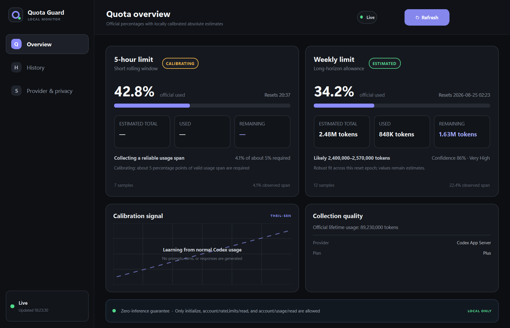
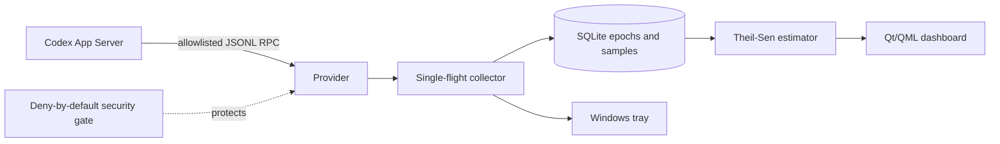

# Codex Quota Guard

[简体中文](docs/README.zh-CN.md) · [Architecture](docs/architecture.md) · [Estimation](docs/estimation.md) · [Privacy](docs/privacy-and-security.md) · [License 中文译文](LICENSE.zh-CN.md)

[](https://github.com/lhfhybxm/codex-quota-guard/actions/workflows/ci.yml)
[](LICENSE)
[](#quick-start)

A local Windows tray monitor that combines Codex's official rate-limit percentages with cumulative usage telemetry to calibrate an estimated absolute allowance—without sending a prompt or starting a model turn.

> [!IMPORTANT]
> Codex Quota Guard is an independent community project. It is not affiliated with, endorsed by, or distributed by OpenAI. It does not increase, reset, bypass, or modify Codex limits.



_The screenshot uses illustrative data. The app never includes demo values in normal operation._

## Why this exists

Codex normally exposes rolling-window usage as a percentage. That is useful, but it does not answer how much absolute usage a cycle represents or whether the allowance changes over time. Quota Guard samples the official percentage and any available cumulative usage counter, keeps 5-hour and weekly reset epochs separate, and fits:

```text
C = a + bP
estimated total Q = 100b
```

The slope is estimated with Theil–Sen pairwise medians, so installing midway through a cycle is supported and one noisy sample does not dominate the result. Before at least five percentage points of valid movement, the UI says **Calibrating** instead of presenting a precise-looking number.

## Safety properties

- The outbound RPC allowlist contains exactly `initialize`, `account/rateLimits/read`, and `account/usage/read`.
- The only outbound notification is `initialized`; the app may receive `account/rateLimits/updated`.
- `turn/start`, `thread/start`, Responses, Chat Completions, reset-credit consumption, account writes, and every unknown method are blocked before transport.
- Codex's existing login is reused through the local App Server. This project never reads, stores, or uploads OAuth credentials.
- Samples, estimates, health state, and logs remain under `%LOCALAPPDATA%\CodexQuotaGuard`.
- Logs redact tokens, authorization headers, cookies, account identifiers, user identifiers, and email addresses.

The security boundary is intentionally deny-by-default; see [Privacy and security](docs/privacy-and-security.md).

## What is available today

| Signal | Source | Treatment |
|---|---|---|
| 5-hour / weekly percentage and reset | `account/rateLimits/read` | Displayed as official data |
| Lifetime token counter and daily buckets | `account/usage/read` | Stored as tokens when returned |
| Absolute cycle allowance | Local robust fit | Estimate shown after sufficient span |
| Purchased-credit state | App Server snapshot | Kept separate from token estimates |
| Per-model input/cached/output split | Not returned by the current account endpoint | Left `null` |
| Estimated credits or USD cost | Not returned by the current account endpoint | Left `null`; never fabricated |

The ChatGPT `wham/usage` endpoint was studied as a possible future provider but is private and not shipped as an active provider. The current implementation uses the official Codex App Server only.

## Quick start

### Release package

1. Download the Windows archive from [Releases](https://github.com/lhfhybxm/codex-quota-guard/releases).
2. Extract the complete folder; do not move only the `.exe` out of it.
3. Run `CodexQuotaGuard.exe` while signed in to Codex.

Closing the window hides it to the Windows tray. Use the tray menu to reopen, refresh, or exit.

### Run from source

Requirements: Windows 10/11, the Python.org CPython 3.11 launcher, and a signed-in `codex` installation on `PATH`.

```powershell
git clone https://github.com/lhfhybxm/codex-quota-guard.git
cd codex-quota-guard
.\scripts\Setup.ps1
.\scripts\Start-CodexQuotaGuard.ps1
```

`Setup.ps1` creates an isolated `.venv-win`; it does not install dependencies system-wide. `Start-CodexQuotaGuard.ps1` starts directly in the tray. Use `-NoTray` to keep a console-owned window during troubleshooting.

Perform one sanitized, read-only probe:

```powershell
.\.venv-win\Scripts\python.exe -m codex_quota_guard --once
```

Build the folder-based Windows package:

```powershell
.\scripts\Build.ps1
```

Each build uses a new timestamped directory under `publish\`; existing builds are never overwritten.

## How collection works



- A read occurs every four minutes by default, with a 30-second cache.
- `account/rateLimits/updated` wakes the collector; timer polling remains the fallback.
- Concurrent timer, event, and manual refreshes collapse into one in-flight read.
- Failures use bounded exponential backoff with jitter and keep stale/unavailable states explicit.
- A new epoch starts when reset time, limit identity, or a high-to-near-zero percentage transition indicates a reset.

## Estimation and confidence

Confidence is a 0–100 score based on sample count, observed percentage span, residuals, local-slope agreement, completeness, freshness, delay, source continuity, and model consistency. Likely ranges use robust slope quantiles plus residual and percentage-rounding allowance. Historical completed cycles form a median/MAD baseline; a high-confidence deviation can raise a quota-change warning.

Full formulas and thresholds are documented in [docs/estimation.md](docs/estimation.md).

## Data and troubleshooting

Default local files:

```text
%LOCALAPPDATA%\CodexQuotaGuard\quota.db
%LOCALAPPDATA%\CodexQuotaGuard\app.log
```

If the dashboard reports unavailable:

1. Confirm `codex --version` works in a terminal.
2. Confirm Codex is signed in.
3. Run the `--once` command above.
4. Review the redacted `app.log`.

The latest local verification evidence is summarized in [docs/real-read-2026-08-20.md](docs/real-read-2026-08-20.md).

## Development

```powershell
.\.venv-win\Scripts\python.exe -m pytest
```

The suite covers estimator noise and outliers, mid-cycle installation, resets, restart persistence, quota-change detection, model mixtures, missing telemetry, RPC failures, recovery, single-flight behavior, the security allowlist, redaction, SQLite, and a headless QML smoke test.

Please read [CONTRIBUTING.md](CONTRIBUTING.md) before changing a provider or transport. Any change that could create inference is out of scope.

## License

[MIT](LICENSE) ([中文参考译文](LICENSE.zh-CN.md)). “OpenAI” and “Codex” are trademarks of their respective owner; their use here is descriptive only.
