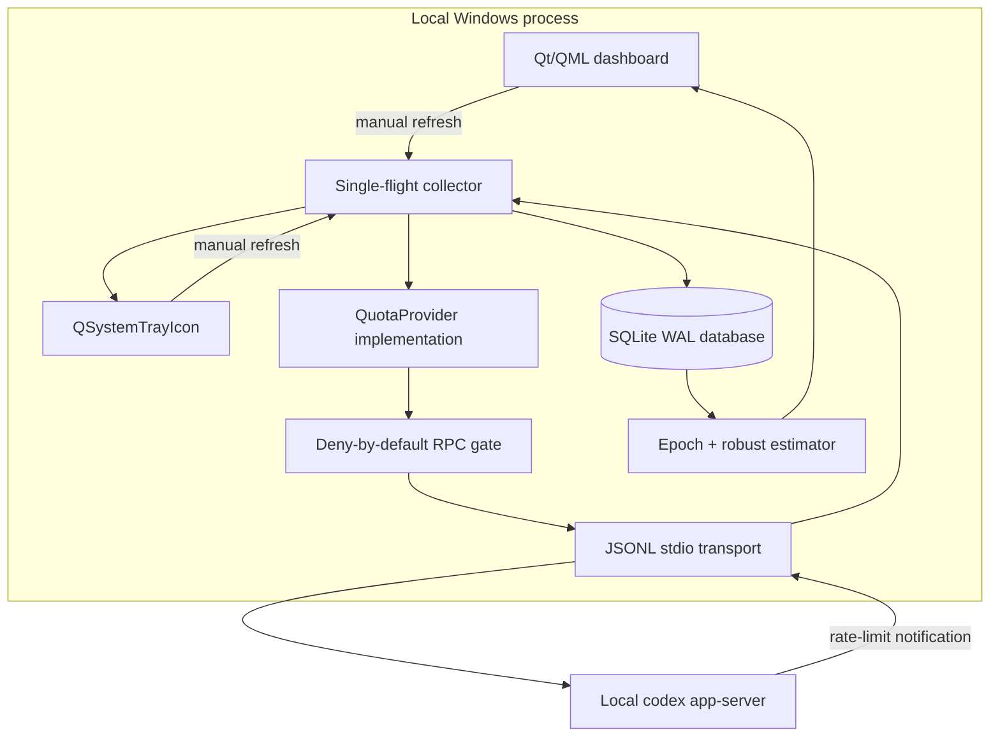

# Architecture

## Boundary and components

`QuotaProvider` is the normalization boundary. The estimator never knows which endpoint produced a snapshot. Only `CodexAppServerProvider` is active in v0.1.0; a private ChatGPT endpoint can be added later without changing storage or estimation, but only after its authentication and read-only behavior can be justified.

## Process model

- The Qt event loop owns all GUI and tray objects.
- The collector runs in a daemon thread and marshals immutable `CollectionResult` objects to Qt through a signal.
- Timer, App Server notifications, and manual refresh all call the same single-flight collector.
- The App Server is a child process connected over newline-delimited JSON on stdin/stdout with `shell=False` and no visible console window.
- On exit, the tray is hidden, collection is stopped, App Server is terminated, SQLite is closed, and Qt exits.

## Collection lifecycle

1. Start `codex app-server --listen stdio://`.
2. Send `initialize`, then the `initialized` notification.
3. Read `account/rateLimits/read`.
4. Read `account/usage/read`; if unsupported, preserve that state explicitly.
5. Normalize windows by duration and keep 5-hour and weekly samples separate.
6. Decide whether each sample continues the active epoch or starts a reset epoch.
7. Insert new samples with a uniqueness constraint.
8. Refit the active epoch and persist the estimate.
9. Publish one result to the dashboard and tray.

The normal polling interval is four minutes. Successful results have a 30-second cache. Failures use exponential backoff starting at 15 seconds, capped at 15 minutes, with ±20% jitter unless the server provides a retry interval.

## Storage

The schema is in [`src/codex_quota_guard/storage/schema.sql`](../src/codex_quota_guard/storage/schema.sql).

- `samples`: raw normalized observations with explicit units and nullable unavailable fields.
- `epochs`: active and archived reset cycles.
- `epoch_estimates`: every recalculated fit.
- `model_usage`: reserved typed storage for model-level telemetry when an official source exposes it.
- `provider_health`: last success/failure, backoff, freshness, and redacted error.
- `settings`: local configuration values.

SQLite uses WAL mode and foreign keys. No migration currently leaves the machine or modifies the Codex account.

## Packaging

PyInstaller builds a folder distribution from Python.org CPython 3.11. A project hook includes only the QML modules used by the app—QtQuick, Basic Controls, Layouts, Templates, Window, QtQml, and QtCore—rather than the full PySide6 QML catalogue. Timestamped build, work, test, icon, and publish paths avoid overwriting prior artifacts.
